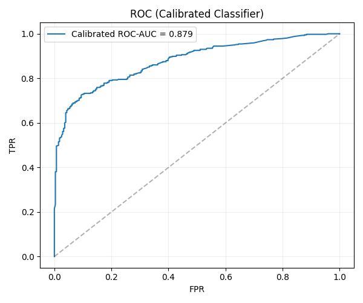
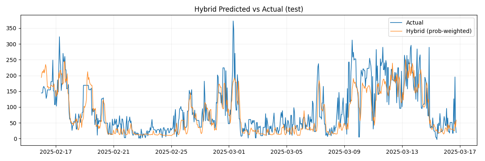
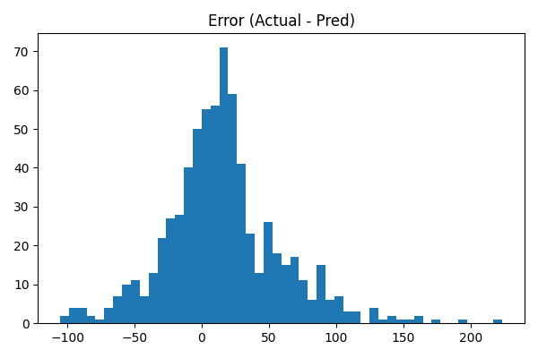

# Hybrid Machine Learning for Power Grid Balancing Forecasting for Finland (2024–2025)

**Goal:**  
Predict *next-hour Up-regulation* requirements in Finland’s Automatic Frequency Restoration Reserve (aFRR) energy market by integrating **market**, **weather**, and **consumption** data using a **hybrid machine learning framework**.

This project combines *classification* and *regression* models to forecast when and how much up-regulation (balancing energy) is needed. The workflow captures both **event occurrence** and **event magnitude**, enabling accurate and interpretable forecasting of grid balancing demand.

---

## Overview

The **Automatic Frequency Restoration Reserve (aFRR)** is part of Finland’s electricity balancing mechanism. It helps stabilize grid frequency deviations by increasing or decreasing generation or demand on short notice.

Dataset - [Link](https://www.kaggle.com/datasets/salehjunior/finland-afrr-energy-market-and-weather-data/versions/1) 

This dataset contains **hourly data** from **June 2024 to March 2025 (UTC)**, merging:
- **Market indicators** (Up, Down, Setpoint, Up/Down capacities)
- **Weather data** (temperature, wind speed, cloud amount, humidity, precipitation)
- **Electricity consumption** and forecasts
- **Public holiday indicators**

The dataset enables studying the link between **weather**, **energy demand**, and **balancing market dynamics**.

---

## Problem Definition

Short-term aFRR forecasting is a **dual challenge**:
1. **Classification:** Will an *up-regulation event* occur in the next hour?  
   (Event defined as `Up_next_hour > 50 MW`)
2. **Regression:** If an event occurs, what is the *magnitude* of the up-regulation?

### Hybrid Approach
We design a **two-stage hybrid model**:
1. **Stage 1 (Classifier):** Predict the probability of an Up event (`P(event)`).
2. **Stage 2 (Regressor):** Predict the expected magnitude of Up given that event.
3. **Final Prediction:**  
   ```
   Up_pred = P(event) × E[Up | event]
   ```
This hybrid formulation is robust for skewed targets (many small or zero values, few large spikes).

---

## Methodology

### 1. Data Preprocessing
- Converted timestamps to UTC, reindexed to hourly continuity.
- Filled small gaps using forward/backward fill.
- Created lag features: {1, 2, 3, 6, 12, 24} hours for:
  - `Up`, `sp`, `Up_Cap`, `Down_Cap`
  - `electricity_consumption`, `forecast`
  - `air_temperature`, `wind_speed`
- Added time-based cyclic features:
  - Hour sin/cos encoding, weekday, weekend flag, month, holiday flag.

### 2. Target Engineering
- `Up_next_hour = Up.shift(-1)`
- Event label: `Up_next_hour > 50.0 MW`

### 3. Chronological Split
Data split by time to avoid leakage:
```
Train: 2024-06-20 → 2025-02-15  
Test:  2025-02-16 → 2025-03-16
```

### 4. Models Compared

#### Classifiers
| Model | Purpose |
|--------|----------|
| RandomForestClassifier | Baseline ensemble classifier |
| XGBoostClassifier | Gradient-boosted decision trees |
| LogisticRegression | Linear baseline |

#### Regressors
| Model | Purpose |
|--------|----------|
| RandomForestRegressor | Nonlinear baseline |
| XGBoostRegressor | Gradient boosting for continuous targets |
| ElasticNet | Regularized linear model |
| GradientBoostingRegressor | Boosted ensemble baseline |

Each classifier × regressor combination was tested using **probability-weighted** and **threshold-based** hybrid predictions.

---

## Modeling Pipeline

```
┌──────────────────────────────────────────────────────┐
│              Raw Market + Weather Data               │
└──────────────────────────────────────────────────────┘
                      │
                      ▼
         Feature Engineering (lags, time vars)
                      │
                      ▼
     ┌──────────────────────────────────────────┐
     │        Classifier (Event Detection)      │
     │   P(event) = Probability of Up > 50 MW   │
     └──────────────────────────────────────────┘
                      │
                      ▼
     ┌──────────────────────────────────────────┐
     │        Regressor (Magnitude Estimation)  │
     │   E[Up | event] = Up magnitude (MW)      │
     └──────────────────────────────────────────┘
                      │
                      ▼
   Final Forecast = P(event) × E[Up | event]
```

---

## Results

### Hybrid Model Comparison (Test Set)

| Rank | Classifier | Regressor | ROC-AUC | Prob. Weighted MAE | RMSE | Optimal Threshold |
|------|-------------|-----------|----------|--------------------|------|-------------------|
| 1 | **RandomForest** | **RandomForestRegressor** | 0.881 | **32.19** | 44.29 | 0.37 |
| 2 | RandomForest | ElasticNet | 0.881 | 32.35 | 44.32 | 0.11 |
| 3 | LogisticRegression | RandomForestRegressor | 0.864 | 32.68 | 45.27 | 0.27 |
| 4 | XGBoostClassifier | ElasticNet | 0.884 | 32.79 | **43.70** | 0.00 |
| 5 | LogisticRegression | ElasticNet | 0.864 | 32.95 | 45.61 | 0.22 |

### Final Selected Hybrid Model
**Classifier:** RandomForest (calibrated with isotonic regression)  
**Regressor:** RandomForestRegressor (trained on `log1p(Up)` target)

| Metric | Value |
|---------|--------|
| MAE (test) | **32.15 MW** |
| RMSE (test) | 44.3 MW |
| ROC-AUC (calibrated) | 0.887 |
| Event-hour MAE | 45.3 MW |

**Improvement:**  
Compared to a direct single-step regression (baseline MAE ~43), this hybrid reduced mean absolute error by **≈25%**.

---

## Visualizations

### 1. ROC Curve (Classifier)


### 2. Predicted vs Actual Up-Regulation


### 3. Error Distribution


---

## Feature Importance (Top 10)

| Rank | Feature | Description |
|------|----------|-------------|
| 1 | `wind_speed_lag_3` | Short-term wind speed influence |
| 2 | `electricity_consumption_forecast_lag_1` | Forecasted demand |
| 3 | `air_temperature_lag_6` | Cooling-related demand |
| 4 | `Up_Cap_lag_3` | Prior up-capacity trend |
| 5 | `hour_sin` | Daily cyclic variation |
| 6 | `sp_lag_12` | Market setpoint pattern |
| 7 | `is_public_holiday` | Demand anomaly indicator |
| 8 | `Down_Cap_lag_6` | Balancing asymmetry signal |
| 9 | `electricity_consumption_lag_24` | Daily lag of demand |
| 10 | `month` | Seasonal patterns |

---

## Key Insights

1. **Tree-based hybrids** outperform pure boosting or linear models.  
   → Nonlinear weather-market interactions are important.

2. **Probability-weighted prediction** smooths overconfident errors.  
   → Improves accuracy on near-threshold events.

3. **Event calibration** (isotonic regression) enhances ROC-AUC stability.

4. **Top drivers:** Wind speed, forecasted consumption, and air temperature.

5. **Practical relevance:**  
   Accurate short-term aFRR forecasting improves renewable integration and grid resilience by pre-empting balancing needs.

---

## Repository Structure

```
aFRR-forecasting/
│
├── notebooks/
│   ├── 01_preprocessing_and_features.ipynb
│   ├── 02_hybrid_modeling.ipynb
│   └── 03_model_comparison_and_analysis.ipynb
│
├── final_artifacts/
│   ├── hybrid_model_comparison.csv
│   ├── final_hybrid_predictions.csv
│   ├── classifier_calibrated.joblib
│   ├── regressor_log1p.joblib
│   ├── plots/
│   │   ├── roc_calibrated.png
│   │   ├── hybrid_pred_vs_actual.png
│   │   └── hybrid_error_hist.png
│   └── summary.txt
│
├── data/               # (optional placeholder for input dataset)
├── requirements.txt
└── README.md
```

---

## Technical Stack

- **Language:** Python 3.11  
- **Libraries:**
  - pandas, numpy, matplotlib, scikit-learn, joblib  
  - xgboost   
- **Model Storage:** `.joblib` (classifier + regressor)  
- **Evaluation Metrics:** MAE, RMSE, ROC-AUC, Event-hour MAE  

---

## 🚀 How to Run

1. Clone the repository:
   ```bash
   git clone https://github.com/<your-username>/aFRR-forecasting.git
   cd aFRR-forecasting
   ```

2. Install dependencies:
   ```bash
   pip install -r requirements.txt
   ```

3. Run the main notebook:
   ```bash
   jupyter notebook notebooks/02_hybrid_modeling.ipynb
   ```

4. Outputs will be saved under:
   ```
   ./final_artifacts/
   ```

---

## 📚 Potential Extensions

- Incorporate **renewable generation** (wind, solar) as external regressors.  
- Use **multi-step forecasting** for 6–24 hour horizon.  
- Implement **quantile regression** for probabilistic forecasts.  
- Test **LSTM / Transformer** architectures for temporal dependencies.  
- Deploy using **FastAPI / Streamlit** for real-time prediction dashboards.

---

## 🌍 Impact

Accurate short-term aFRR forecasting supports:
- **Sustainable grid management**  
- **Reduced balancing costs**  
- **Higher renewable integration**  
- **Better energy policy planning**

This hybrid approach bridges **machine learning** and **energy systems**, advancing real-world AI applications in sustainable power systems.

---

## Author

Nyal Dhirajlal Kakadia
B.Tech, Computer Science and Engineering — VIT Vellore  
Passionate about energy analytics, deep learning, and AI for sustainability.

Connect with me:  
[LinkedIn](www.linkedin.com/in/nyal-dhirajlal-kakadia) | [GitHub](https://github.com/isltown)


